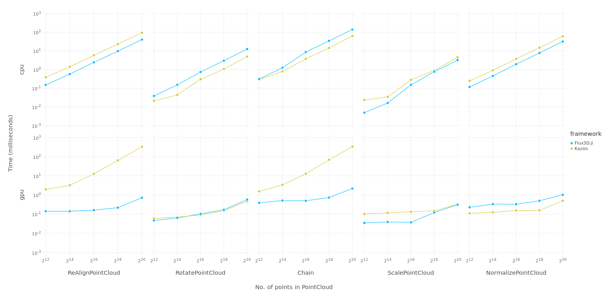
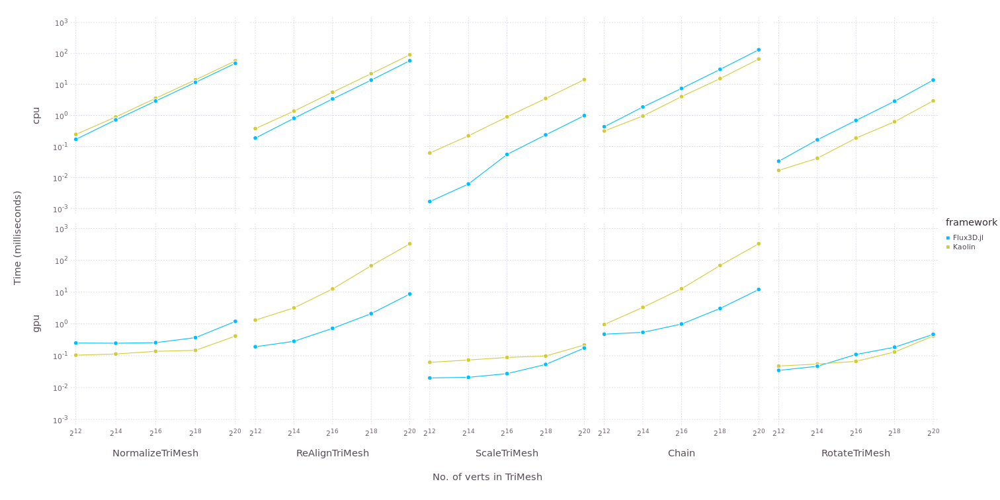
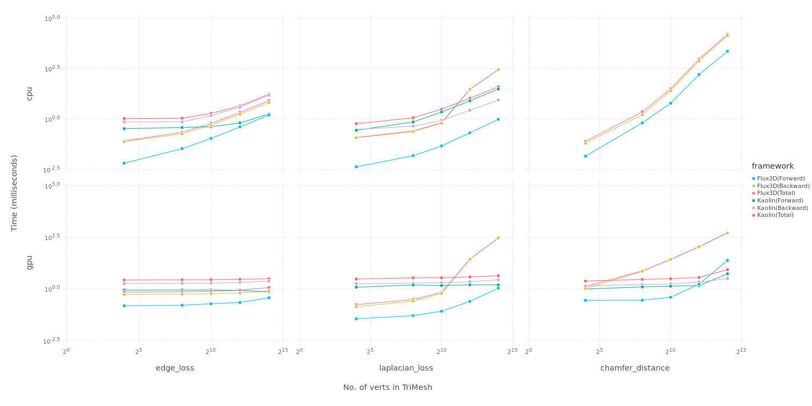

<p align="center">
  
</p>
<p>
<h1 align="center">Flux3D.jl</h1>
</p>

<p align="center">
  <a href="https://nirmal-suthar.github.io/Flux3D.jl/dev" alt="Dev">
    
  </a>
  <a href="https://github.com/nirmal-suthar/Flux3D.jl/actions" alt="Build Status">
    
  </a>
  <a href="https://gitlab.com/JuliaGPU/Flux3D-jl/commits/master" alt="Pipeline Status">
    
  </a>
  <a href="https://codecov.io/gh/nirmal-suthar/Flux3D.jl" alt="Codecov">
    
  </a>
</p>
<br/>

Flux3D.jl is a 3D vision library, written completely in Julia. This package utilizes [Flux.jl](github.com/FluxML/Flux.jl) and [Zygote.jl](github.com/FluxML/Zygote.jl) as its building blocks for training 3D vision models and for supporting differentiation. This package also have support of CUDA GPU acceleration with [CUDA.jl](github.com/JuliaGPU/CUDA.jl).The primary motivation for this library is to provide:

* Batched Data structure for 3D data like PointCloud and TriMesh for storing and computation.
* Transforms and general utilities for processing 3D structures.
* Metrics for defining loss objectives and predefined 3D models.
* Easy access to loading an pre-processing standard 3D datasets.
* Visualization utilities for PointCloud and TriMesh.

Any suggestions, issues and pull requests are most welcome.

## Installation

This packages is currently not registered and under development. To install the master branch, type the following in the Julia 1.3+ prompt.

```julia
julia> ] add https://github.com/nirmal-suthar/Flux3D.jl
```

To reproduce the benchmarks, install the ns/benchmarks branch by typing following in the Julia prompt.

```julia
julia> ] add https://github.com/nirmal-suthar/Flux3D.jl#ns/benchmarks
```

## Examples

<div align="center">
  <table>
    <tr>
      <th style="text-align:center">
        <a href="examples/pointnet_classification.jl">PointNet Classfication</a>
      </th>
      <th style="text-align:center">
        <a href="examples/pointnet_classification.jl">DGCNN Classification</a>
      </th>
      <th style="text-align:center">
        <a href="examples/fit_mesh.jl">Supervised 3D recontruction</a>
      </th>
    </tr>
    <tr>
      <td align="center">
        <a href="examples/teapot_rendering.jl">
          
        </a>
      </td>
      <td align="center">
        <a href="examples/inverse_lighting.jl">
          
        </a>
      </td>
      <td align="center">
        <a href="examples/fit_mesh.jl">
          
        </a>
      </td>
    </tr>
  </table>
</div>


## Usage Examples

```julia

julia> using Flux3D

julia> m = load_trimesh("teapot.obj") |> gpu
TriMesh{Float32, UInt32, CUDA.CuArray} Structure:
    Batch size: 1
    Max verts: 1202
    Max faces: 2256
    offset: -1
    Storage type: CUDA.CuArray

julia> laplacian_loss(m)
0.05888283f0

julia> compute_verts_normals_packed(m)
3×1202 CUDA.CuArray{Float32,2,Nothing}:
  0.00974202   0.00940375   0.0171322   …   0.841262   0.777704   0.812894
 -0.999953    -0.999953    -0.999848       -0.508064  -0.607522  -0.557358
  6.14616f-6   0.00249814  -0.00317568     -0.184795  -0.161533  -0.168985

julia> new_m = Flux3D.normalize(m)
TriMesh{Float32, UInt32, CUDA.CuArray} Structure:
    Batch size: 1
    Max verts: 1202
    Max faces: 2256
    offset: -1
    Storage type: CUDA.CuArray

julia> save_trimesh("normalized_teapot.obj", new_m)
```

## Benchmarks

### PointCloud Transforms (Flux3D.jl and Kaolin)


### TriMesh Transforms (Flux3D.jl and Kaolin)


### Metrics (Flux3D.jl and Kaolin)


## Current Roadmap

- [X] Add Batched Structure for PointCloud and TriMesh.
- [X] Add Transforms/Metrics for PointCloud and TriMesh.
- [X] GPU Support using CUDA.jl
- [X] Add Dataset support for ModelNet10/40.
- [ ] Add Batched 3D structure and Transform for Voxels.
- [ ] Interconversion between different 3D structures like PointCloud, Voxel and TriMesh.
- [ ] Add more metrics for TriMesh (like normal_consistency and cloud_mesh_distance)
